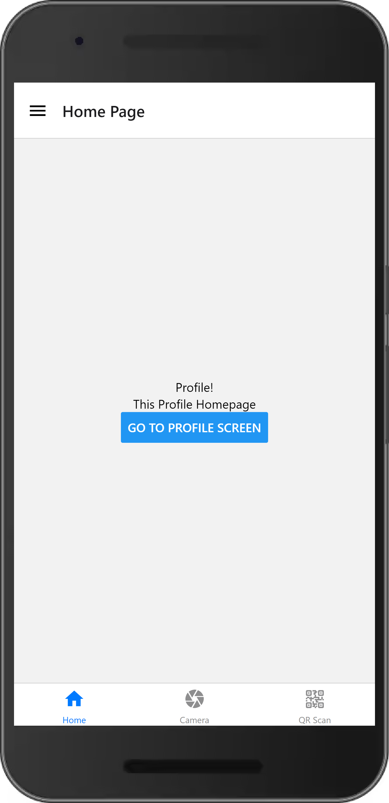
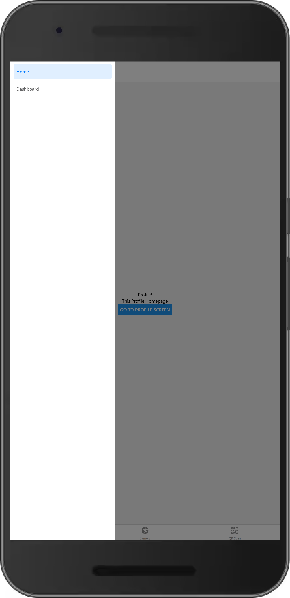

## Features :
- Camera
- Barcode scanner





## Install depedencies
```
yarn global add expo-cli eas-cli
yarn install
```

## Run projects :
```
yarn web
yarn android
yarn ios
```

## Build apk / aab to expo

- Edit expo name & slug in app.json
- Login to your expo using eas
```
eas login
```

- Build apk Command :

```
eas build -p android --profile preview
```

- Build aab
```
eas build -p android --profile production
```

## Build web publish to vercel / any hosting
```
yarn build
```
> output : /web-build/